# 🎓 Placement Sarthi — Campus Placement Management System

<p align="center">
  🚀 A comprehensive Spring Boot web application that automates and streamlines the entire campus placement process, eliminating manual coordination through a centralized platform for students, companies, and administrators.
</p>

<p align="center"> 
   
   
   
   
   
   
   
</p>

<br>

---

## 📖 Problem Statement
The conventional campus placement system suffers from significant inefficiencies due to its reliance on fragmented, manual processes:

### Communication Bottlenecks
- **Email Overload**: Placement cells exchange 100+ emails per company, creating communication chaos and missed information
- **Information Delays**: Critical updates about tests, interviews, and results take days to reach all stakeholders
- **Platform Fragmentation**: Communication happens across emails, WhatsApp, phone calls, and physical notice boards

### Administrative Overhead
- **Data Duplication**: Students re-enter identical information across multiple Google Forms for different companies
- **Time Consumption**: Placement officers spend 60-70% of their time on administrative coordination rather than strategy
- **Manual Processes**: Every placement drive requires creating new forms, spreadsheets, and communication templates

### Data Management Challenges
- **Siloed Information**: Student data resides in separate Excel sheets, email attachments, and paper records
- **Error-Prone Updates**: Manual data entry leads to incorrect eligibility lists and missed opportunities
- **Poor Analytics**: No centralized system to track placement trends, success rates, or student performance

### Process Inefficiencies
- **Limited Scalability**: Manual systems struggle to handle multiple placement drives simultaneously
- **Repetitive Work**: The same administrative tasks repeat for every company visit
- **Compliance Risks**: Manual processes increase chances of errors in critical placement documentation

These inefficiencies result in delayed placements, reduced company participation, student frustration, and suboptimal placement outcomes that directly impact institutional reputation and student career prospects.

<br>

---

## 💡 Our Solution
Placement Sarthi revolutionizes campus recruitment by providing an integrated, automated platform that eliminates fragmentation and manual inefficiencies. Our solution delivers:

### **For Students: Comprehensive Career Management**
- **Single-Source Profile Management**: Create and maintain one comprehensive profile accessible to all incoming recruiters.
- **Intelligent Event Discovery**: Single click apply option for matching placement drives based on eligibility, interests, and skills.
- **Real-time Application Tracking**: Monitor application status from registration to final selection.
- **Resume Management**: Google Drive integration for centralized resume storage and sharing.

### **For Companies: Streamlined Recruitment Operations**
- **Simplified Registration**: Single-point registration with approval workflow and verification.
- **Targeted Job Postings**: Create detailed position descriptions with specific eligibility criteria.
- **Smart Candidate Filtering**: AI-powered shortlisting based on CGPA, skills, department, and other parameters.
- **Smart Scheduling**: Schedule Online Assesments and Interviews efficiently.
- **Compliance Management**: Ensure adherence to institutional placement policies and procedures.

### **For Administrators: Centralized Placement Governance**
- **Complete User Management**: Approve, monitor, and manage all student and company accounts.
- **Event Orchestration**: End-to-end coordination of placement drives from announcement to completion.
- **Policy Enforcement**: Configure and enforce institutional placement rules and eligibility criteria.
- **Student Management**: Management of Students with various placement related metrics.

### **Enterprise-Grade Operations Management**
- **Bulk Data Processing**: Excel/CSV import/export for student registrations, company data, and event management
- **Role-Based Messaging**: Secure communication channels between companies, and administrators
- **Audit Trail**: Complete logging of all communications and transactions for transparency and compliance
- **Modern Technology Stack**: Built with Spring Boot, MySQL, and responsive frontend technologies
- **Security First**: Role-based access control, data encryption, and secure authentication
- **API-First Design**: RESTful APIs enabling future integrations with HR systems and educational platforms

This holistic solution transforms campus placement from a fragmented, manual process into a streamlined, automated ecosystem where technology enhances human potential rather than complicating it.

<br>

---

## 🏗️ System Architecture

Placement Sarthi follows a modern **three-tier architecture** with clear separation of concerns, ensuring scalability, maintainability, and security.

### 🎯 High-Level Architecture Diagram

```mermaid
graph TB
    subgraph "Presentation Layer"
        A[Student Portal<br/>HTML • CSS • JavaScript]
        B[Company Portal<br/>HTML • CSS • JavaScript]
        C[Admin Portal<br/>HTML • CSS • JavaScript]
        D[Placement Cell<br/>Placement Portal Frontend]
    end
    
    A --> F[Web Browser]
    B --> F
    C --> F
    D --> F
    
    subgraph "Application Layer"
        F --> G[RESTful API Gateway]
        G --> H[Spring Boot Server]
        H --> I[Business Logic Layer]
    end
    
    subgraph "Data Layer"
        I --> J[(MongoDB Database)]
    end
    
    subgraph "Support Services"
        K[Authentication Service]
        L[Email Notification Service]
        M[File Processing Service]
    end
    
    I --> K
    I --> L
    I --> M
    
    style D fill:#e1f5fe
    style A fill:#f3e5f5
    style B fill:#e8f5e8
    style H fill:#fff3e0
```



<p align="center">
  <b>Figure 1: High-level system architecture showing interaction between presentation, application, and data layers</b>
</p>


<br>

### 🔄 Detailed Service Architecture


<p align="center">
  <b>Figure 2: Detailed service architecture showing dependency injection and layered design</b>
</p>

<br>

---

## 🏛️ Architectural Components

### **Presentation Layer**
- **Student Portal**: Responsive interface for profile management and application tracking
- **Company Portal**: Dashboard for recruitment activities and candidate management
- **Admin Portal**: Comprehensive control panel for system administration
- **Placement Cell Interface**: Central coordination hub for placement officers

### **Application Layer**
- **Spring Boot Backend**: Robust REST API server handling business logic
- **Controller Classes**: Handle HTTP requests and responses with proper validation
- **Service Classes**: Implement business logic and transaction management
- **Dependency Injection**: Spring Framework's IoC container for loose coupling

### **Data Layer**
- **Repository Pattern**: Abstraction layer for database operations
- **JPA/Hibernate**: Object-Relational Mapping for database interactions
- **MySQL Database**: Relational database with optimized schemas
- **Data Transfer Objects**: Secure data transfer between layers

### **Support Services**
- **Authentication Service**: Role-based access control and session management
- **Email Notification**: Automated alerts and communication
- **File Processing**: Excel/CSV import/export for bulk operations
- **CORS Configuration**: Secure cross-origin resource sharing

### Data Flow Process

1. **Request Initiation**: Client sends HTTP request to specific endpoint
2. **Controller Handling**: Request validated and forwarded to appropriate service
3. **Business Logic**: Service layer processes request, applies business rules
4. **Data Access**: Repository interfaces with database via JPA
5. **Response Building**: Data transformed to DTOs and sent back to client
6. **Presentation**: Frontend renders response in appropriate format


**This architecture ensures:**
- **Scalability**: Horizontal scaling capability for growing user base
- **Maintainability**: Clear separation of concerns and modular design
- **Security**: Multiple layers of protection against vulnerabilities
- **Performance**: Optimized database queries and efficient API design
- **Reliability**: Transaction management and error handling mechanisms

<br>

---


## 🗄️ About The Database

Placement Sarthi follows a traditional NoSQL Database, implemented with MongoDB having multiple entities participating in relationships for ensuring scalability, maintainability, and security.

### 🎯VISUAL REPRESENTATION OF ER DIAGRAM


<br>

### 🔄 Data Flow Diagram


<br>

---

## 🚀 Key Features

### Student Module
- **Profile Management**: Complete academic and personal information
- **Event Registration**: Register for placement drives
- **Application Tracking**: Monitor application status
- **Resume Management**: Google Drive integration for resume storage
- **Dashboard Analytics**: Performance metrics and progress tracking

### Company Module
- **Registration & Approval**: Company onboarding workflow
- **Job Postings**: Create and manage placement opportunities
- **Candidate Search**: Filter and shortlist eligible students
- **Event Management**: Schedule and manage placement drives

### Admin Module
- **User Management**: Approve/disable student and company accounts
- **Event Coordination**: Create and manage all placement events
- **Bulk Operations**: Import/export data via Excel/CSV
- **Analytics Dashboard**: Placement statistics and reports
- **System Configuration**: Manage platform settings

### Technical Features
- **Role-based Authentication**: Secure access for all user types
- **RESTful APIs**: Complete CRUD operations for all entities
- **Excel Processing**: Bulk data import/export functionality
- **Real-time Messaging**: Communication between stakeholders
- **Responsive Design**: Mobile-friendly interface
- **Database Relationships**: Optimized MySQL schema

<br>

---

## 🛠️ Tech Stack

<div align="center"><table> <thead> <tr> <th>🖥️ Technology</th> <th>⚙️ Description</th> </tr> </thead> <tbody> <tr> <td></td> <td>Backend framework with embedded Tomcat</td> </tr> <tr> <td></td> <td>Core backend language (Java 17+)</td> </tr> <tr> <td></td> <td>NoSQL document database</td> </tr> <tr> <td></td> <td>MongoDB integration and repository abstraction</td> </tr> <tr> <td></td> <td>Structure of web pages</td> </tr> <tr> <td></td> <td>Styling web pages</td> </tr> <tr> <td></td> <td>Client-side interactions</td> </tr> <tr> <td></td> <td>Authentication and authorization</td> </tr> </tbody> </table></div>

<br>

---

## 📁 Project Directory Structure

```
Placement-Sarthi/
├── 📁 src/
│   └── 📁 main/
│       ├── 📁 java/
│       │   └── 📁 com/placementPortal/placement/Sarthi/
│       │       ├── 📄 PlacementSarthiApplication.java          # Spring Boot main class - starts the application
│       │       ├── 📁 config/
│       │       │   └── 📄 CordConfig.java                      # CORS configuration for frontend-backend communication
│       │       ├── 📁 controller/                              # REST API endpoints
│       │       │   ├── 📄 StudentController.java               # Handles student profile and application APIs
│       │       │   ├── 📄 CompanyController.java               # Manages company registration and job posting APIs
│       │       │   ├── 📄 AdminController.java                 # Administrative functions and user management APIs
│       │       │   ├── 📄 EventController.java                 # Event creation and management APIs
│       │       │   ├── 📄 WebController.java                   # Serves static pages and general web requests
│       │       │   ├── 📄 MessageController.java               # Handles messaging system between users
│       │       │   ├── 📄 ParticipationController.java         # Manages event participation registrations
│       │       │   └── 📄 BulkOperationController.java         # Handles bulk data import/export operations
│       │       ├── 📁 entity/                                  # Database models (JPA entities)
│       │       │   ├── 📄 Student.java                         # Student entity with profile and academic details
│       │       │   ├── 📄 Company.java                         # Company entity with profile and job postings
│       │       │   ├── 📄 Admin.java                           # Administrator entity with system privileges
│       │       │   ├── 📄 Event.java                           # Placement event entity with details and dates
│       │       │   ├── 📄 Message.java                         # Message entity for communication system
│       │       │   └── 📄 Participation.java                   # Tracks student participation in events
│       │       ├── 📁 repository/                              # Data access layer (JPA repositories)
│       │       │   ├── 📄 StudentRepository.java               # Database operations for students
│       │       │   ├── 📄 CompanyRepository.java               # Database operations for companies
│       │       │   ├── 📄 AdminRepository.java                 # Database operations for admins
│       │       │   ├── 📄 EventRepository.java                 # Database operations for events
│       │       │   ├── 📄 MessageRepository.java               # Database operations for messages
│       │       │   └── 📄 ParticipationRepository.java         # Database operations for participations
│       │       ├── 📁 service/                                 # Business logic layer
│       │       │   ├── 📄 StudentService.java                  # Interface for student business operations
│       │       │   ├── 📄 CompanyService.java                  # Interface for company business logic
│       │       │   ├── 📄 AdminService.java                    # Interface for admin system operations
│       │       │   ├── 📄 EventService.java                    # Interface for event management
│       │       │   ├── 📄 ExcelProcessingService.java          # Handles Excel file parsing and data extraction
│       │       │   ├── 📄 BulkOperationService.java            # Manages bulk data operations
│       │       │   ├── 📄 MessageService.java                  # Interface for messaging system
│       │       │   ├── 📄 ParticipationService.java            # Interface for participation tracking
│       │       │   └── 📁 impl/                                # Service implementations
│       │       │       ├── 📄 StudentServiceImpl.java          # Concrete implementation of student service
│       │       │       ├── 📄 CompanyServiceImpl.java          # Concrete implementation of company service
│       │       │       ├── 📄 AdminServiceImpl.java            # Concrete implementation of admin service
│       │       │       └── 📄 EventServiceImpl.java            # Concrete implementation of event service
│       │       └── 📁 dto/                                     # Data Transfer Objects
│       │           ├── 📄 BulkOperationRequest.java            # Request DTO for bulk operations
│       │           └── 📄 ParticipationDTO.java                # DTO for participation data transfer
│       └── 📁 resources/                                       # Application resources
│           ├── 📄 application.properties                       # Spring Boot configuration (database, server settings)
│           └── 📁 static/                                      # Frontend static assets
│               ├── 📁 css/                                     # Stylesheets
│               │   ├── 📄 student_dashboard.css                # Student dashboard styling
│               │   ├── 📄 company_dashboard.css                # Company dashboard styling
│               │   ├── 📄 admin_page.css                       # Admin interface styling
│               │   ├── 📄 login_page.css                       # Login page design
│               │   └── 📄 index.css                            # Main landing page styling
│               ├── 📁 js/                                      # Client-side JavaScript
│               │   ├── 📄 student_dashboard.js                 # Student dashboard functionality
│               │   ├── 📄 company_dashboard.js                 # Company dashboard functionality
│               │   ├── 📄 admin_page.js                        # Admin interface functionality
│               │   ├── 📄 login_page.js                        # Login form validation
│               │   └── 📄 index.js                             # Main page interactivity
│               ├── 📁 images/                                  # Visual assets (logos, icons, etc.)
│               ├── 📄 index.html                               # Main landing page
│               ├── 📄 login_page.html                          # User authentication page
│               ├── 📄 student_dashboard.html                   # Student portal interface
│               ├── 📄 company_dashboard.html                   # Company portal interface
│               └── 📄 original-admin.html                      # Administrative control panel
├── 📄 pom.xml                                                  # Maven configuration with dependencies
└── 📄 README.md                                                # Project documentation and setup guide
```

<br>

---

## 📸 Application Screenshots

### 🏠 Home Page
<p align="center">
  
  <br>
  
  <br>
  
</p>

<br>

### 🔐 Login Page
<p align="center">
  
</p>

<br>

### 🎓 Student Portal
<p align="center">
  
</p>

<br>

### 🏢 Company Portal
<p align="center">
  
</p>

<br>

### 👨‍💼 Admin Portal
<p align="center">
   
</p>

<br>

---

## 🚀 Quick Start Guide

### Prerequisites
- ✅ **Java 17** or higher
- ✅ **Maven 3.6** or higher
- ✅ **MySQL 8.0** or higher
- ✅ **Modern web browser** (Chrome, Firefox, Edge)


### Installation & Setup

1. **Clone the repository**
   ```bash
   git clone https://github.com/Abhay-k12/Placement-Portal.git
   cd Placement-Portal
   ```

2. **Configure database**
   ```bash
     # For Ubuntu/Debian
    sudo apt-get install mongodb
    sudo systemctl start mongod
    
    # For macOS
    brew tap mongodb/brew
    brew install mongodb-community
    brew services start mongodb-community
    
    # For Windows
    # Download from https://www.mongodb.com/try/download/community
   ```

3. **Update application properties**
   ```properties
    # src/main/resources/application.properties
    spring.data.mongodb.host=localhost
    spring.data.mongodb.port=27017
    spring.data.mongodb.database=placement_sarthi
    spring.data.mongodb.username=your_usename
    spring.data.mongodb.password=your_password_here
    
    # MongoDB specific properties
    spring.data.mongodb.auto-index-creation=true
   ```

4. **Build and run the application**
   ```bash
   mvn clean install
   mvn spring-boot:run
   ```

5. **Access the application**
   ```
   http://localhost:8080
   ```

<br>

---

## 🧪 Testing & Validation
<div align="center">

| Test Type | Status | Notes |
|-----------|--------|-------|
| Unit Testing | ✅ Pass | Spring Boot's built-in testing framework |
| Integration Testing | ✅ Pass | API endpoints validated through Postman |
| Database Testing | ✅ Pass | Schema and relationships verified |
| Frontend UI Testing | ✅ Pass | All functionality verified across browsers |
| Security Testing | ✅ Pass | Authentication flow tested |
| Performance Testing | ✅ Pass | Optimized database queries and indexing |

</div>

<br>

---

## 🔧 Challenges & Solutions

<div align="center">
  
| Challenge | Solution Implemented |
|-----------|---------------------|
| **CORS Configuration** | Created dedicated `CordConfig.java` with comprehensive settings |
| **File Upload Handling** | Implemented robust exception handling and validation in `ExcelProcessingService` |
| **Database Relationships** | Used `@JsonIgnore` and DTO patterns to handle circular dependencies |
| **Frontend-Backend Integration** | Established clear API contracts and error handling standards |
| **Bulk Data Processing** | Implemented streaming Excel processing for large datasets |

</div>

<br>

---

## 📊 Project Progress & Deliverables
- **Student Module**: Complete with profile, events, and resume management
- **Company Module**: Full registration and job posting workflow
- **Admin Module**: Comprehensive user and event management
- **Event Management**: End-to-end event creation and tracking
- **Bulk Operations**: Excel import/export functionality


<br>

---

## 🌱 Future Enhancements

- **Notification System**: Email/SMS alerts for events and updates
- **Mobile Application**: Easy to access Mobile platform app
- **Advanced Analytics**: Machine learning for placement predictions
- **Resume Parser**: Automated extraction of skills and experience
- **Interview Scheduling**: Automated calendar integration
- **Placement Analytics**: Detailed metrics and reporting dashboard
- **Chatbot Support**: AI-powered assistance for students
- **Multi-language Support**: International student accessibility

<br>

---

## 📞 Help & Contact

> 💬 *Need help with Placement Sarthi or want to contribute?*  
> We're always open to collaboration and feedback!

<div align="center">

### 👤 Abhay Kanojia (Team Lead & Backend Developer)
<a href="https://www.linkedin.com/in/abhay-kanojia-0461a3341">
  
</a>

### 👤 Anvesha Rawat (Frontend Developer & Database)
<a href="https://www.linkedin.com/in/anvesha-rawat-b9a1a0308">
  
</a>

</div>

<br>

<div align="center">


---

<p align="center">
  <i>"Streamlining campus placements, one connection at a time."</i>
</p>
